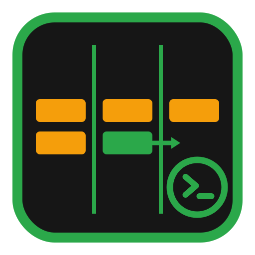

<p align="center">
  
</p>

<h1 align="center">KanbanMate</h1>

**Reusable Kanban orchestrator with a native, KanbanMateUI-first board.** Each roadmap item is a ticket moved column by column on a board; moving a card into a triggering column fires an autonomous Claude Code agent in an isolated tmux + git-worktree workspace. The agent comments on the ticket, may re-move the card (only to non-triggering columns), and its session is resumable (`tmux attach` / `claude --resume <uuid>`). Placement authority is a **local `board.json`** per project (the web UI and monitoring views read it, sub-second); GitHub Projects v2 is kept in sync as a **one-way mirror** (KanbanMate writes `board.json` first, then mirrors the Status to GitHub), and a card you drag on the GitHub board is ingested back through a small **webhook receiver**. A single background daemon (`kanban run`, PM2-supervised) ticks the board and reconciles it against persisted state. Each ticket is routed through one of three **fast-track lanes** — **full / lite / express** — by a Triage classifier; merge stays **human-only** in every lane.

## Two artifacts, one repo

| Artifact          | What                                                                                                                                                      | Install                                                   |
| ----------------- | --------------------------------------------------------------------------------------------------------------------------------------------------------- | --------------------------------------------------------- |
| **Engine**        | Python package `kanbanmate` + CLI `kanban` + bundled assets (PM2 ecosystem, `columns.yml`/`transitions.yml`/`sensitive.yml` templates, agent helper bins) | `pip install kanbanmate`                                  |
| **Claude plugin** | Skill `/kanban` (thin shell to the `kanban` CLI) + agent helper commands                                                                                  | `claude plugin marketplace add` + `claude plugin install` |

All logic lives in the engine; the plugin only invokes `kanban …`.

## 5-minute quickstart

```bash
# 1. Install the engine (host tier + claude tier)
pip install kanbanmate          # or: pip install -e ".[dev]" for development
kanban install                   # creates ~/.kanban, writes PM2 ecosystem, installs /kanban plugin

# 2. Initialise a board for your repo (per-repo tier)
kanban init --repo owner/name    # GitHub Project v2 + columns + labels; registers the project
                                 # (board_backend defaults to native one-way; ingress=polling)

# 3. Seed the board from your roadmap
kanban seed ROADMAP.md --repo owner/name
                                 # project id auto-resolves from the registry; issues land in Backlog

# 4. Start the daemon
kanban run                       # foreground (Ctrl-C to stop)
# OR let PM2 supervise it (set up by `kanban install`):
pm2 start ecosystem.config.js --only kanban
```

That's it. Move a card into a triggering column and watch an agent fire.

```bash
kanban status                    # board summary + running agents
kanban sessions                  # list live agent tmux sessions
kanban doctor                    # full health check (engine, daemon, plugin, token, permissions)
kanban poll --once               # single dry-run tick (debug)
kanban board import              # re-sync board.json from GitHub (REQUIRED after a column change)
```

> **Gotcha:** after you change the columns on the GitHub board, run `kanban board import` so the
> local `board.json` learns the new column. Native placement will not reconcile a card into a
> column it does not know about.

The optional pieces extend the same engine:

```bash
kanban serve                     # webhook receiver (ingests GitHub-side card drags; PM2 kanban-km-serve)
kanban config serve              # KanbanMateUI — the config builder + monitoring SPA (PM2 kanban-km-config)
```

## Project status (dashboard health pill)

The daemon maintains one rolling **status update** on the GitHub Project board — a single health "pill". KanbanMate uses its **own health vocabulary** (`INACTIVE` · `BLOCKED` · `WAITING` · `ACTIVE` · `COMPLETE`), chosen to mirror the agent/board states. GitHub's status-update pill is a fixed enum (`ProjectV2StatusUpdateStatus`) we can't rename, so the daemon **maps** each KanbanMate health onto it (`ACTIVE→On track`, `WAITING→At risk`, `BLOCKED→Off track`; `INACTIVE`/`COMPLETE` unchanged): the colored pill keeps GitHub's labels, while the status-update **body** and `kanban status` show KanbanMate's name. The health is computed every state change from the live orchestration (running agents, the launch queue, recent events) with strict first-match-wins precedence, so at a glance you know whether the board is active or needs you.

| Health (KanbanMate) | GitHub pill | When it fires (first match wins)                                                                                                                                                                                 | What you should do                                                                                                                  |
| ------------------- | ----------- | ---------------------------------------------------------------------------------------------------------------------------------------------------------------------------------------------------------------- | ----------------------------------------------------------------------------------------------------------------------------------- |
| **INACTIVE**        | Inactive    | The `~/.kanban/PAUSE` kill-switch is set — the daemon is paused and launches no agents.                                                                                                                          | Resume orchestration by removing the PAUSE sentinel (`rm ~/.kanban/PAUSE`).                                                         |
| **BLOCKED**         | Off track   | A blocking/failure event is recent (a `block` or `gate_fail`), **or** an agent is parked in the **Blocked** column.                                                                                              | Open the ticket, read the agent's last comment, fix the blocker, then re-move the card out of Blocked.                              |
| **WAITING**         | At risk     | A degraded signal: an agent is **WAITING** for human input, a stale agent was reaped/relaunched, a move was rate-limit-parked, the launch queue exceeds the concurrency cap, or an agent's heartbeat went stale. | If an agent is waiting, attach and answer it: `tmux attach -t ticket-<n>`. Otherwise check `kanban status` for the degraded reason. |
| **ACTIVE**          | On track    | Agents are running and/or events are flowing with none of the above degraded/blocked/paused signals — normal healthy progress.                                                                                   | Nothing — let the agents work; glance at `kanban status` when you like.                                                             |
| **COMPLETE**        | Complete    | Fully idle: no agents running and no recent events — the orchestration reads as done rather than ongoing.                                                                                                        | Nothing — seed more roadmap items (`kanban seed …`) when you're ready for the next batch.                                           |

For the full picture: [how-it-works.md](docs/how-it-works.md) · [lanes.md](docs/lanes.md) · [configuration.md](docs/configuration.md) · [kanbanmateui.md](docs/kanbanmateui.md) · [install.md](docs/install.md) · [columns.md](docs/columns.md) · [deployment.md](docs/reference/deployment.md) · [ROADMAP.md](ROADMAP.md).
